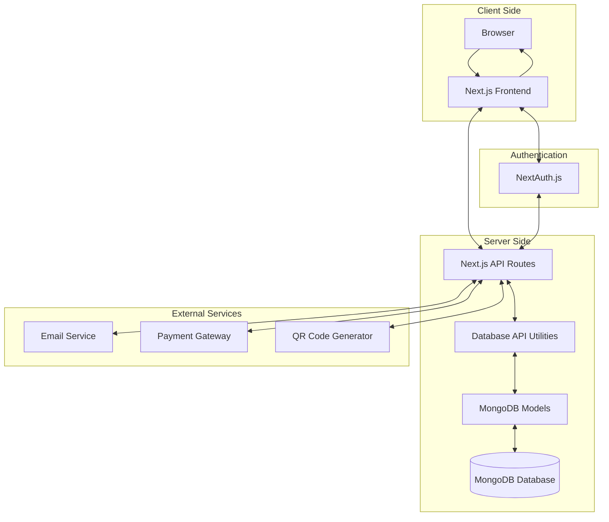

# Barbaros Barbershop Management System Documentation

## Overview

Barbaros is a comprehensive barbershop management system built with Next.js, MongoDB, and TypeScript. The system includes features for appointment scheduling, client management, loyalty tracking, QR code integration, and more.

This documentation provides details about the database setup, models, API endpoints, and overall system architecture.

## Table of Contents

1. [Database Setup](./database-setup.md)
2. [Data Models](./data-models.md)
3. [Database Seeding](./database-seeding.md)
4. [API Endpoints](./api-endpoints.md)
5. [Authentication](./authentication.md)
6. [Development Guide](./development-guide.md)

## System Architecture

The Barbaros system is built using the following technologies:

- **Frontend**: Next.js, React, Tailwind CSS
- **Backend**: Next.js API Routes
- **Database**: MongoDB with Mongoose ODM
- **Authentication**: NextAuth.js
- **Styling**: Tailwind CSS

The application follows a modern architecture with:

- App Router for routing
- Server Components for improved performance
- API Routes for backend functionality
- MongoDB for flexible data storage
- TypeScript for type safety

### Architecture Diagram



## Project Structure

```
barbaros-app/
├── src/
│   ├── app/                # Next.js App Router
│   │   ├── (landing)/      # Landing page routes
│   │   ├── (dashboard)/    # Dashboard routes
│   │   │   ├── admin/      # Admin dashboard
│   │   │   └── client/     # Client dashboard
│   │   ├── api/            # API endpoints
│   │   ├── login/          # Authentication pages
│   │   └── register/       # Registration pages
│   ├── components/         # React components
│   │   ├── shared/         # Shared components
│   │   └── ui/             # UI components
│   └── lib/                # Utility libraries
│       ├── auth/           # Authentication utilities
│       ├── db/             # Database utilities
│       │   ├── api/        # Database API utilities
│       │   ├── models/     # MongoDB models
│       │   ├── mongodb.ts  # MongoDB connection
│       │   └── seed.ts     # Database seeding
│       └── utils/          # Utility functions
├── docs/                   # Documentation
├── public/                 # Static assets
└── ...                     # Configuration files
```

## Getting Started

To get started with the documentation, navigate to the specific sections using the links in the Table of Contents above.

For development setup instructions, refer to the [Development Guide](./development-guide.md).

## Contributors

- Development Team: Barbaros Barbershop Management System Team 