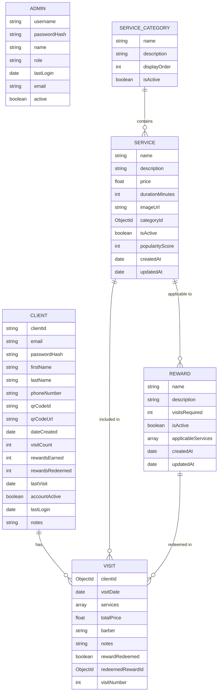

# Data Models

## Overview

The Barbaros system uses MongoDB as its database, with Mongoose as the ODM (Object Data Modeling) library. The data is organized into several collections, each represented by a Mongoose model.

## Entity Relationship Diagram

Below is a detailed entity relationship diagram showing the relationships between the different collections:



## Models

### Admin Model

The Admin model represents staff members who can access the admin dashboard.

#### Schema

```typescript
interface IAdmin extends Document {
  username: string;
  passwordHash: string;
  name: string;
  role: 'owner' | 'barber' | 'receptionist';
  lastLogin?: Date;
  email: string;
  active: boolean;
  comparePassword(candidatePassword: string): Promise<boolean>;
}
```

#### Fields

| Field         | Type     | Description                                   |
|---------------|----------|-----------------------------------------------|
| username      | String   | Unique login username                         |
| passwordHash  | String   | Securely hashed password                      |
| name          | String   | Admin's name                                  |
| role          | String   | Role (owner, barber, receptionist)            |
| lastLogin     | Date     | Timestamp of last login                       |
| email         | String   | Admin email address                           |
| active        | Boolean  | Whether admin account is active               |

#### Methods

- `comparePassword(candidatePassword: string)`: Compares a candidate password with the stored hash

### Client Model

The Client model represents customers of the barbershop.

#### Schema

```typescript
interface PreferredService {
  serviceId: mongoose.Types.ObjectId;
  count: number;
}

interface IClient extends Document {
  clientId: string;
  email: string;
  passwordHash: string;
  firstName: string;
  lastName: string;
  phoneNumber: string;
  qrCodeId?: string;
  qrCodeUrl?: string;
  dateCreated: Date;
  visitCount: number;
  rewardsEarned: number;
  rewardsRedeemed: number;
  lastVisit?: Date;
  accountActive: boolean;
  lastLogin?: Date;
  notes?: string;
  preferredServices: PreferredService[];
  comparePassword(candidatePassword: string): Promise<boolean>;
}
```

#### Fields

| Field            | Type     | Description                                  |
|------------------|----------|----------------------------------------------|
| clientId         | String   | Unique identifier                            |
| email            | String   | Client email address (for login)             |
| passwordHash     | String   | Hashed password for client portal            |
| firstName        | String   | Client's first name                          |
| lastName         | String   | Client's last name                           |
| phoneNumber      | String   | For lookups and verification                 |
| qrCodeId         | String   | Unique identifier for QR code (for scanning) |
| qrCodeUrl        | String   | API URL to retrieve the QR code image        |
| dateCreated      | Date     | When client was added to system              |
| visitCount       | Number   | Total number of visits                       |
| rewardsEarned    | Number   | Total rewards earned                         |
| rewardsRedeemed  | Number   | Total rewards redeemed                       |
| lastVisit        | Date     | Date of last visit                           |
| accountActive    | Boolean  | Whether account is active                    |
| lastLogin        | Date     | Last client login to portal                  |
| notes            | String   | Any special client preferences or notes      |
| preferredServices| Array    | Array of preferred services                  |

**qrCodeId**: Used as the unique identifier encoded in the QR code for client identification and scanning.

**qrCodeUrl**: API endpoint to retrieve the QR code image for the client (used in both admin and client dashboards).

#### Methods

- `comparePassword(candidatePassword: string)`: Compares a candidate password with the stored hash

#### Virtuals

- `fullName`: Returns the client's full name (firstName + lastName)

### Visit Model

The Visit model represents a client's visit to the barbershop.

#### Schema

```typescript
interface ServiceReceived {
  serviceId: mongoose.Types.ObjectId;
  name: string;
  price: number;
  duration: number;
}

interface IVisit extends Document {
  clientId: mongoose.Types.ObjectId;
  visitDate: Date;
  services: ServiceReceived[];
  totalPrice: number;
  barber: string;
  notes?: string;
  rewardRedeemed: boolean;
  redeemedRewardId?: mongoose.Types.ObjectId;
  visitNumber: number;
}
```

#### Fields

| Field           | Type     | Description                                  |
|-----------------|----------|----------------------------------------------|
| clientId        | ObjectId | Reference to client                          |
| visitDate       | Date     | Date and time of visit                       |
| services        | Array    | Array of services received                   |
| totalPrice      | Number   | Total price for all services                 |
| barber          | String   | Name of barber who provided service          |
| notes           | String   | Notes about this specific visit              |
| rewardRedeemed  | Boolean  | Whether a reward was used for this visit     |
| redeemedRewardId| ObjectId | Reference to the redeemed reward             |
| visitNumber     | Number   | Which visit number this is for the client    |

### Service Model

The Service model represents services offered by the barbershop.

#### Schema

```typescript
interface IService extends Document {
  name: string;
  description: string;
  price: number;
  durationMinutes: number;
  imageUrl?: string;
  categoryId: mongoose.Types.ObjectId;
  isActive: boolean;
  popularityScore: number;
  createdAt: Date;
  updatedAt: Date;
}
```

#### Fields

| Field           | Type     | Description                                  |
|-----------------|----------|----------------------------------------------|
| name            | String   | Name of service                              |
| description     | String   | Description of the service                   |
| price           | Number   | Regular price                                |
| durationMinutes | Number   | Typical duration                             |
| imageUrl        | String   | URL to service image                         |
| categoryId      | ObjectId | Reference to service category                |
| isActive        | Boolean  | Whether the service is currently offered     |
| popularityScore | Number   | Calculated score based on selection frequency|
| createdAt       | Date     | When service was added                       |
| updatedAt       | Date     | When service was last updated                |

### ServiceCategory Model

The ServiceCategory model represents categories of services.

#### Schema

```typescript
interface IServiceCategory extends Document {
  name: string;
  description: string;
  displayOrder: number;
  isActive: boolean;
}
```

#### Fields

| Field        | Type     | Description                                  |
|--------------|----------|----------------------------------------------|
| name         | String   | Category name                                |
| description  | String   | Category description                         |
| displayOrder | Number   | Order to display categories in               |
| isActive     | Boolean  | Whether category is active                   |

### Reward Model

The Reward model represents loyalty rewards that clients can earn.

#### Schema

```typescript
interface IReward extends Document {
  name: string;
  description: string;
  visitsRequired: number;
  isActive: boolean;
  applicableServices: mongoose.Types.ObjectId[];
  createdAt: Date;
  updatedAt: Date;
}
```

#### Fields

| Field             | Type     | Description                                  |
|-------------------|----------|----------------------------------------------|
| name              | String   | Name of reward                               |
| description       | String   | Description of what the reward includes      |
| visitsRequired    | Number   | Visits needed to earn this reward            |
| isActive          | Boolean  | Whether the reward is currently offered      |
| applicableServices| Array    | Services this reward can be applied to       |
| createdAt         | Date     | When reward was created                      |
| updatedAt         | Date     | When reward was last updated                 |

## Indexes

### Admin Model

- `username`: Unique index
- `email`: Unique index

### Client Model

- `clientId`: Unique index
- `email`: Unique index
- `lastName`, `firstName`: Compound index for sorting

### Visit Model

- `clientId`, `visitDate`: Compound index for client visit history
- `visitDate`: Index for date-based queries
- `barber`: Index for barber-specific queries

### Service Model

- `categoryId`: Index for category-based queries
- `popularityScore`: Index for sorting by popularity
- `isActive`: Index for filtering active services

### ServiceCategory Model

- `displayOrder`: Index for sorting by display order

### Reward Model

- `visitsRequired`: Index for sorting by visits required
- `isActive`: Index for filtering active rewards

## Data Validation

All models include validation rules to ensure data integrity:

- Required fields are enforced
- String fields have appropriate trimming
- Numeric fields have minimum values where appropriate
- Password fields are hashed before saving
- References between collections are properly typed

## Next Steps

For information on the API utilities that interact with these models, see the [API Endpoints](./api-endpoints.md) documentation. 